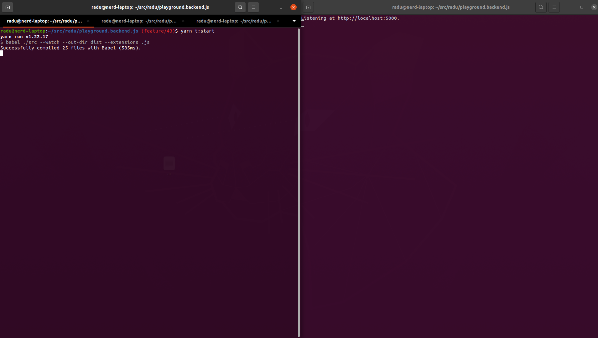

## Playground.Backend.Js
A simple backend written in pure JS, using algebraic data 
types and functions only.

## Requirements
Stuff needed to be met before starting the dev process.

- nodejs v16.13.1
- yarn

## Run
Stuff needed to be done in order to start the api.

- Start the transpile process.
  - `yarn t:start`
- Start the server process (in another terminal).
  - `yarn t:start`
- Api will listen at the link shown in the second terminal.
  - `Listening at ...`
